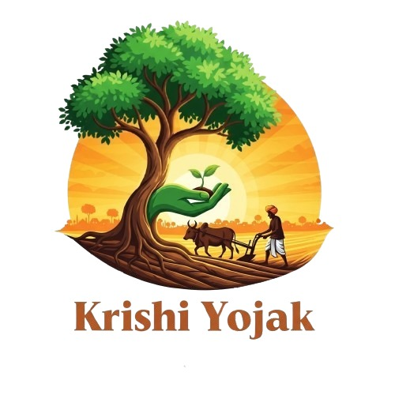

  <h1>Krishi Yojak 🌱</h1>
  

---

## 📌 Overview  
**Krishi Yojak** is a multilingual smart farming app built to support **small and marginal farmers**.  
It provides **simple, timely, and accessible crop guidance** in multiple local languages so that even **elderly farmers** can benefit.  
The app was developed as part of **Smart India Hackathon 2025** by **Team MisFit Techies (MVLUHACK05)**.

---

## ✨ Key Features  
- 🌾 **Crop Guidance:** Right advice on soil, pesticides, medicines, and farming practices.  
- 🗣️ **Multilingual Support:** Available in Hindi, Marathi, English, and Punjabi.  
- 📱 **Easy-to-Use UI:** Simple design, accessible for farmers of all age groups.  
- 💧 **Irrigation Reminders:** Helps save water and improve yields.  
- 🌱 **Fertilizer Recommendations:** Personalized suggestions for better soil and crop health.  
- 📊 **Government Schemes Info:** Access to subsidies, schemes, and other farming resources.  

---

## 👥 Team  
- **Team Name:** MisFit Techies  
- **Team ID:** MVLUHACK05  
- **Event:** Smart India Hackathon 2025  
- **Theme:** Agriculture, FoodTech & Rural Development  

---

## 📥 Download App  
👉 [Click here to Download Krishi Yojak](https://Krishi-yojak-app-download.netlify.app)

---

## 📧 Contact  
For any queries or feedback, please reach out to the team leader:  
**fyit.bhumika@gmail.com**
